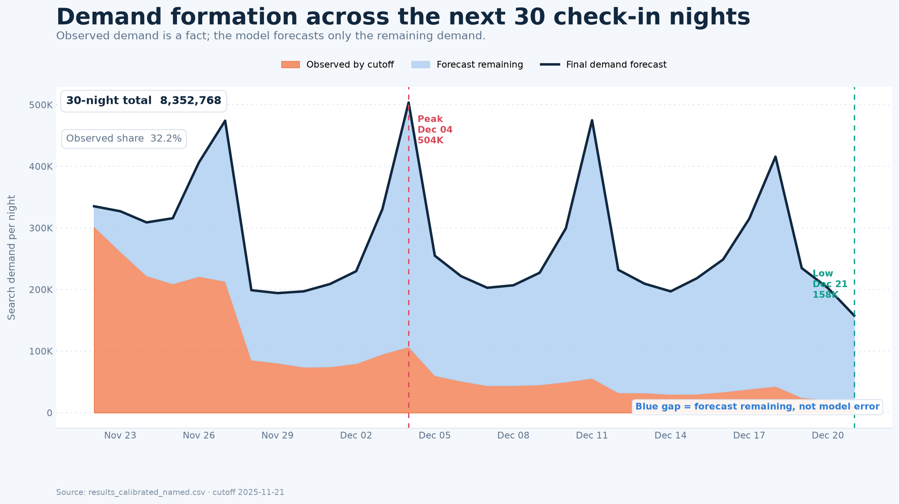
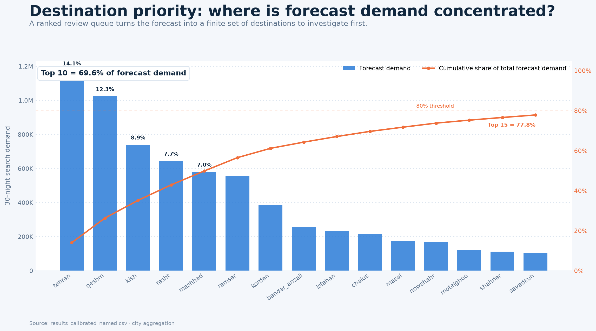
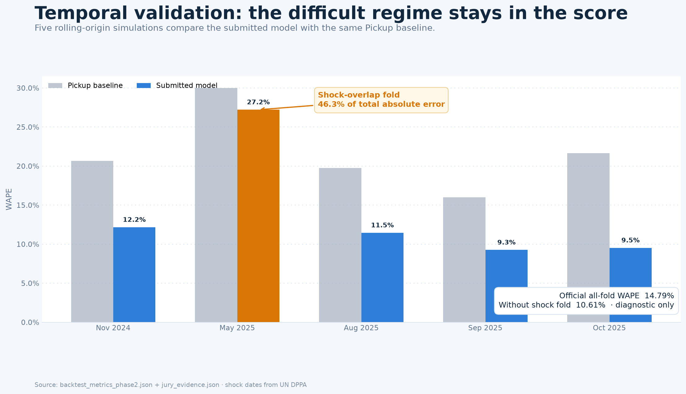
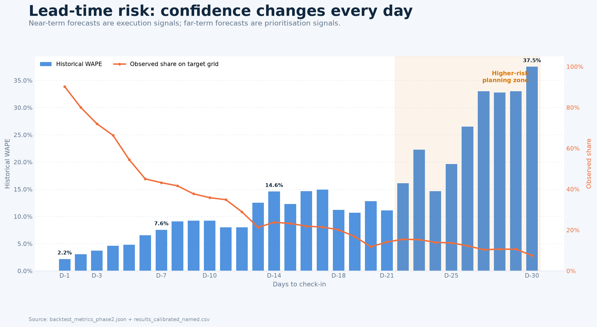
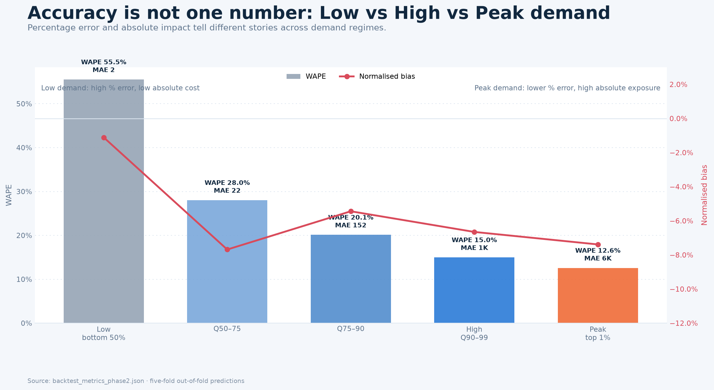
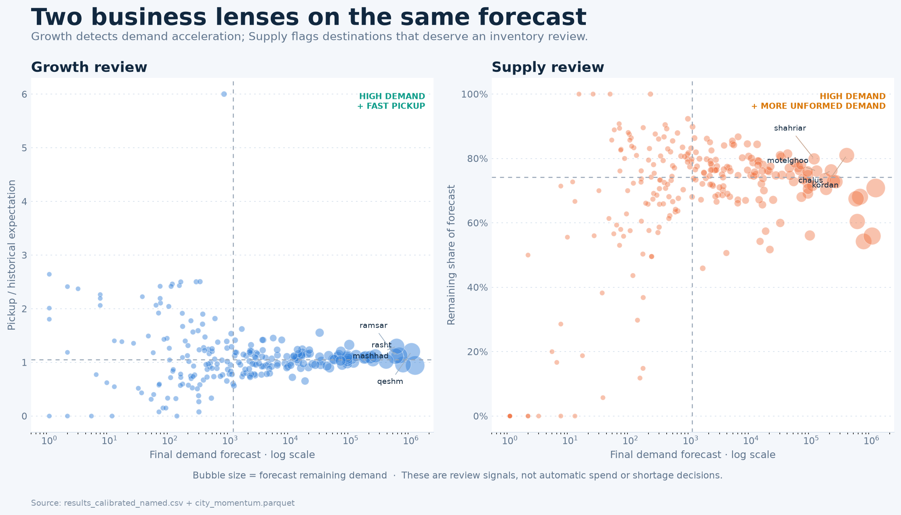
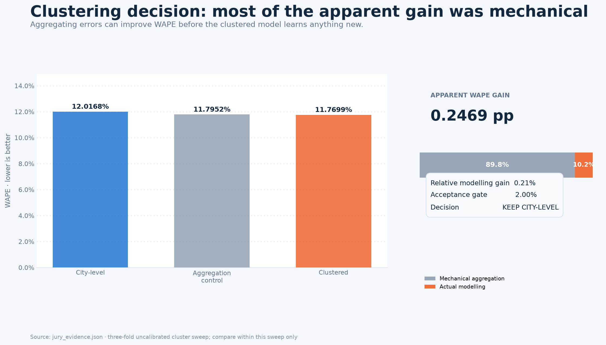

# Narrative و Storytelling نهایی ارائه Novo Pulse

این ساختار برای فرمت اصلی **۷ دقیقه Presentation + ۷ دقیقه Q&A** طراحی شده است. بخش اصلی عمداً ۸ اسلاید کوتاه دارد؛ جزئیات فنی مهم حذف نشده‌اند، بلکه مواردی که جریان داستان را می‌شکنند به `Appendix` منتقل شده‌اند.

## پیام مرکزی

```text
Novo Pulse فقط عدد نهایی Demand را پیش‌بینی نمی‌کند؛
تقاضای مشاهده‌شده را از بخش هنوز شکل‌نگرفته جدا می‌کند،
مقصدها را برای بررسی اولویت‌بندی می‌کند،
و مرز اعتماد Forecast را نیز نشان می‌دهد.
```

داستان باید به این ترتیب پیش برود:

```text
Blind spot → Early signal → Ranked decision → Technical credibility
→ Honest validation → Decision guardrails → Business action
```

سه جمله‌ای که باید در ذهن داور بماند:

1. `Final Demand = Observed So Far + Forecast Remaining`
2. مدل اصلی در `five-fold rolling-origin backtest` به WAPE برابر **14.79%** در مقابل baseline برابر **22.00%** رسیده است.
3. این Forecast یک `Review Trigger` است، نه مجوز خودکار هزینه یا اثبات کمبود Supply.

---

# Main Deck

## Slide 1 — The blind spot

**زمان:** ۰:۰۰ تا ۰:۳۵  
**نقش در داستان:** ساختن مسئله، بدون ورود به الگوریتم

### فقط این‌ها روی اسلاید باشند

```text
Travel demand does not appear all at once.

321 destinations · 30 check-in nights · one decision cutoff
```

هیچ جدول یا نموداری لازم نیست. پس‌زمینه ساده و یک خط زمانی کوچک از `Today` تا `Check-in` کافی است.

### دیالوگ پیشنهادی

> «مسئله ما صرفاً پیش‌بینی یک عدد نبود. Search demand سفر به‌مرور و تا نزدیک check-in شکل می‌گیرد. اگر تیم مقصد فقط Searchهای ثبت‌شده تا امروز را ببیند، ممکن است رشد یک مقصد را دیر تشخیص دهد؛ و اگر فقط Forecast نهایی را ببیند، نمی‌داند چه مقدار آن واقعیت ثبت‌شده و چه مقدار تخمین مدل است. ما برای ۳۲۱ مقصد و ۳۰ شب آینده یک Early-warning signal ساختیم که این دو را از هم جدا می‌کند.»

### Transition

> «پس اولین تصمیم فنی ما این بود که کل Demand را دوباره پیش‌بینی نکنیم؛ فقط بخش نامعلوم را Forecast کنیم.»

---

## Slide 2 — Forecast only what is still unknown

**زمان:** ۰:۳۵ تا ۱:۲۰  
**نقش در داستان:** توضیح Solution و Two-clock formulation

### Visual



### فقط این فرمول کنار نمودار باشد

```text
Final Demand = Observed So Far + Forecast Remaining
```

### دیالوگ پیشنهادی

> «در داده دو clock داریم: `log_date` زمان وقوع Search و `check-in` زمان سفر است. در cutoff، قسمت نارنجی واقعاً مشاهده شده و مدل به آن دست نمی‌زند. قسمت آبی Demandی است که هنوز اتفاق نیفتاده و مدل Forecast می‌کند. خط تیره جمع این دو و خروجی نهایی است. فاصله آبی Model Error نیست؛ `Predicted Remaining Demand` است. در grid فعلی ۳۲.۲ درصد Demand مشاهده شده و ۶۷.۸ درصد هنوز باید پیش‌بینی شود؛ طبیعی است که این فاصله برای شب‌های دورتر بزرگ‌تر باشد.»

### چیزی که نباید گفته شود

نگویید بخش آبی `Uncertainty` یا `Confidence Interval` است. این بخش Forecast نقطه‌ای Remaining Demand است.

### Transition

> «اما Forecast زمانی ارزش دارد که از آن یک تصمیم محدود و قابل اجرا بسازیم.»

---

## Slide 3 — Turn 321 forecasts into a review queue

**زمان:** ۱:۲۰ تا ۲:۰۰  
**نقش در داستان:** اولین Product value؛ Forecast به‌عنوان ابزار Prioritisation

### Visual



### فقط این پیام بزرگ روی اسلاید باشد

```text
Top 10 destinations = 69.6% of forecast demand
```

### دیالوگ پیشنهادی

> «هدف محصول این نیست که Analyst هر ۳۲۱ شهر را هم‌زمان بررسی کند. ستون‌ها Forecast هر شهر و خط نارنجی Cumulative Share از کل Demand همه ۳۲۱ شهر است. ده شهر اول ۶۹.۶ درصد Demand را پوشش می‌دهند. بنابراین خروجی مدل یک Ranked Review Queue می‌سازد: تیم زمان محدودش را ابتدا روی مقصدهایی می‌گذارد که بیشترین Exposure را دارند.»

### نکته ارائه

خط `Cumulative Share` باید بالا برود، چون سهم هر شهر به مجموع قبلی اضافه می‌شود. Top 15 به ۷۷.۸٪ می‌رسد؛ تنها با نمایش همه ۳۲۱ شهر به ۱۰۰٪ می‌رسیم.

### Business wording درست

```text
Prioritise investigation
```

نه:

```text
Automatically allocate campaign budget
```

### Transition

> «برای اینکه این Queue قابل اعتماد باشد، باید نشان دهیم پشت آن چه Data contract و Model designی قرار دارد.»

---

## Slide 4 — A leakage-aware forecasting engine

**زمان:** ۲:۰۰ تا ۳:۰۰  
**نقش در داستان:** Technical core بدون نمایش فهرست طولانی Featureها

### Layout مینیمال

یک Flow افقی پنج‌مرحله‌ای؛ در هر مرحله فقط یک عدد و یک عبارت:

```text
3.30M raw rows
Validated sparse events
        ↓
2.655M train rows
321 × 752 × 11 snapshots
        ↓
66 time-safe features
Pickup · Velocity · Calendar · City · Market · Province
        ↓
Two LightGBM bands
D1–14 · D15–30 · log1p remaining target
        ↓
Guarded calibration + observed floor
9,630 valid city × check-in predictions
```

### دیالوگ پیشنهادی

> «از ۳.۲۹۸ میلیون ردیف sparse Search شروع کردیم و duplicate، تاریخ نامعتبر و lead time را کنترل کردیم. Trainset از روی grid زمانی ساخته شد: ۳۲۱ شهر، ۷۵۲ روز و ۱۱ snapshot تاریخی؛ در مجموع ۲.۶۵۵ میلیون ردیف، بدون row cap. مدل ۶۶ Feature در خانواده‌های Pickup، Velocity، Activity، Calendar، City History، Market و Province دارد و همه آن‌ها روی grid واقعی submission قابل محاسبه‌اند. Target همان Remaining Demand با `log1p` است تا right-skew کاهش پیدا کند. یک LightGBM برای D1 تا D14 و یکی برای D15 تا D30 داریم. در انتها calibration محافظت‌شده اعمال می‌شود و observed floor اجازه نمی‌دهد Forecast از Search مشاهده‌شده کمتر شود.»

### نکته مهم Featureها

روی اسلاید نام هر ۶۶ Feature را نمایش ندهید. در Q&A بگویید `city_weekday_mean`، `city_hist_mean` و Pickup-based features از مهم‌ترین Signalها بودند. فهرست کامل در Technical Report است.

### Transition

> «این معماری فقط وقتی ارزش دارد که در چند نقطه تاریخی و بدون نگاه به آینده از Baseline بهتر باشد.»

---

## Slide 5 — Keep the difficult regime in the score

**زمان:** ۳:۰۰ تا ۴:۰۵  
**نقش در داستان:** اثبات Accuracy، Generalisation و صداقت Evaluation

### Visual



### سه عدد روی اسلاید

```text
Model WAPE       14.79%
Pickup baseline  22.00%
Relative gain    32.8%
```

### دیالوگ پیشنهادی

> «Evaluation ما random split نیست؛ پنج `Rolling-origin` شبیه‌سازی می‌کند که در هر cutoff تاریخی چه اطلاعاتی در دسترس بوده است. در مجموع ۴۸٬۱۵۰ prediction خارج از Train داریم. مدل روی هر پنج fold از Pickup baseline بهتر است و WAPE pooled را از ۲۲ به ۱۴.۷۹ درصد رسانده؛ یعنی ۳۲.۸ درصد بهبود نسبی. ستون نارنجی مهم‌ترین بخش این نمودار است: target fold می با شروع جنگ ایران و اسرائیل در ۱۳ ژوئن هم‌پوشانی دارد، WAPE آن ۲۷.۲۲ درصد است و ۴۶.۳ درصد کل Absolute Error را ساخته. ما آن را حذف نکردیم. عدد ۱۰.۶۱ درصد بدون این fold فقط Sensitivity Diagnostic است، نه Score رسمی.»

### Event/Holiday موضع دقیق

> «جنگ Feature مدل نیست، چون Shock ناگهانی در زمان Forecast قابل دانستن نبوده است. Eventهای برنامه‌پذیر نیز تا زمانی که Calendar رسمی، سال‌به‌سال، Geographic و Versioned نداشته باشیم وارد مدل نمی‌شوند؛ مخصوصاً تاریخ قمری که هر سال جابه‌جا می‌شود.»

### چیزی که نباید گفته شود

- جنگ ایران و آمریکا نبود؛ artifact پروژه جنگ ایران و اسرائیل را ثبت کرده است.
- هم‌زمانی Fold با جنگ، `Causal Effect` را اثبات نمی‌کند.
- WAPE بدون Fold جنگ Score رسمی نیست.

### Transition

> «یک WAPE کلی هنوز کافی نیست؛ سطح اعتماد مدل با فاصله تا check-in تغییر می‌کند.»

---

## Slide 6 — Confidence is a function of lead time

**زمان:** ۴:۰۵ تا ۴:۵۵  
**نقش در داستان:** تبدیل Metric به Decision Policy

### Visual



### Policy کوتاه پایین اسلاید

```text
D1–7 Execute carefully · D8–21 Monitor · D22–30 Prioritise only
```

### دیالوگ پیشنهادی

> «Accuracy یک عدد ثابت نیست. در D1 تقریباً ۹۰ درصد Demand grid فعلی مشاهده شده و WAPE تاریخی حدود ۲.۲ درصد است. در D30 فقط ۷.۵ درصد مشاهده شده و WAPE به ۳۷.۵ درصد می‌رسد. بنابراین Forecast نزدیک می‌تواند وارد Tactical Review شود، ولی Forecast دور برای Ranking و Scenario Planning است، نه Commit قطعی بودجه یا ظرفیت. خود Product باید این تفاوت اعتماد را نمایش دهد، نه اینکه یک Confidence یکسان به همه تاریخ‌ها بدهد.»

### Transition

> «همین تفاوت فقط زمانی نیست؛ Scale تقاضا هم نوع ریسک را عوض می‌کند.»

---

## Slide 7 — Percentage error and business exposure are different

**زمان:** ۴:۵۵ تا ۵:۴۰  
**نقش در داستان:** پاسخ مستقیم به High/Low/Peak demand و Dimension analysis

### Visual



### فقط دو Callout

```text
Low demand:  WAPE 55.5% · MAE ≈ 2 searches
Peak demand: WAPE 12.6% · MAE ≈ 5.9K searches
```

### دیالوگ پیشنهادی

> «Overall WAPE می‌تواند دو ریسک متفاوت را پنهان کند. در نیمه Low-demand، چون مخرج کوچک است WAPE حدود ۵۵.۵ درصد دیده می‌شود، اما MAE فقط نزدیک دو Search است. در Peak یک درصد بالا، WAPE بهتر و حدود ۱۲.۶ درصد است، ولی MAE نزدیک ۵.۹ هزار Search و Business Exposure بسیار بزرگ‌تر است. بنابراین برای تصمیم، WAPE را کنار Bias، MAE، Sample Size و Actual Volume می‌خوانیم. همین Evaluation برای Province، Weekday و Observation State نیز در Dashboard قابل فیلتر است.»

### Transition

> «وقتی Scale، Momentum و Confidence را کنار هم بگذاریم، Forecast به دو Workflow مشخص تبدیل می‌شود.»

---

## Slide 8 — One forecast, two review workflows

**زمان:** ۵:۴۰ تا ۷:۰۰  
**نقش در داستان:** Product use cases، محدودیت تجاری و Closing

### Visual



### دو کارت بسیار کوتاه

```text
Growth Review
High demand + faster-than-expected pickup

Supply Review
High demand + high remaining share
```

و پایین اسلاید:

```text
Review signal ≠ automatic spend or proof of shortage
```

### دیالوگ پیشنهادی

> «در Growth، بالا-راست مقصدهایی هستند که هم Demand بالایی دارند و هم Pickup آن‌ها سریع‌تر از انتظار تاریخی است؛ این‌ها اولویت بررسی Content و Campaign Calendar هستند. در Supply، مقصدهای با Demand بالا و Remaining Share زیاد اولویت بررسی Inventory و جذب میزبان‌اند. اما Search به‌تنهایی Conversion، Revenue یا Shortage را ثابت نمی‌کند. برای تصمیم مالی باید Booking، Available Inventory، Margin و Campaign Exposure به همین grain متصل شوند.»

> «در دو روز، از Data validation و ساخت Trainset تا Forecast نهایی، Rolling-origin Evaluation، Calibration، Lead-time و Demand-segment diagnostics و یک Dashboard قابل بررسی جلو رفتیم. دستاورد اصلی فقط WAPE بهتر نیست؛ سیستمی است که می‌گوید کجا را بررسی کنیم، چه مقدار از Demand هنوز نامعلوم است و در چه شرایطی نباید بیش‌ازحد به Forecast اعتماد کنیم. قدم بعدی، اتصال داده‌های Booking و Inventory و ارزیابی این Review Queue در یک Pilot کنترل‌شده است.»

### جمله آخر؛ دقیق حفظ شود

> «Novo Pulse یک Forecast زودهنگام، قابل Audit و Segment-aware است که علاوه بر Prediction، مرز اعتماد خودش را هم نشان می‌دهد.»

سپس توقف کنید و وارد Q&A شوید.

---

# Appendix برای Q&A

Appendix را در Main Story نمایش ندهید، مگر داور سؤال مرتبط بپرسد.

## Appendix A — Why City-level, not Clustering?



### پاسخ ۳۰ثانیه‌ای

> «Clustering را برای Pooling شهرهای کم‌داده تست کردیم. WAPE ظاهراً از ۱۲.۰۱۶۸ به ۱۱.۷۶۹۹ درصد رسید؛ اما Aggregation Control نشان داد ۸۹.۸ درصد این کاهش صرفاً Mechanical است. Relative Modelling Gain فقط ۰.۲۱ درصد بود و Gate دو درصدی را رد کرد. چون Clustering Granularity تصمیم شهر را هم از بین می‌برد، مدل City-level را نگه داشتیم.»

### محدودیت ضروری

این اعداد یک `three-fold uncalibrated sweep` هستند و فقط داخل همان آزمایش قابل مقایسه‌اند؛ آن‌ها را با WAPE پنج-fold calibrated مدل نهایی مقایسه نکنید.

## Appendix B — What did Calibration actually improve?

```text
Raw model             WAPE 15.51% · Bias -9.86%
Guarded calibration   WAPE 14.79% · Bias -6.82%
Aggressive candidate  WAPE 17.22% · Bias -1.34% · rejected
```

### پاسخ ۳۰ثانیه‌ای

> «هدف ما صفرکردن Bias به هر قیمت نبود. Candidate تهاجمی Bias را تقریباً صفر کرد ولی WAPE را خراب کرد. Guarded Calibration فقط زمانی پذیرفته شد که Accuracy را هم حفظ یا بهتر کند. Selection در Prequential setup فقط از Foldهای کاملاً بسته‌شده قبلی استفاده می‌کند.»

## Appendix C — Is the output valid?

```text
9,630 rows = 321 cities × 30 nights
0 duplicate city × check-in keys
0 negative predictions
0 observed-floor violations
Total demand = 8,352,768
```

فایل رسمی:

```text
artifacts/pol4/results.csv
```

## Appendix D — What is not solved yet?

- فقط ۷ Province در Panel وجود دارد؛ Coverage کل ایران نیست.
- Booking، Conversion، Inventory، Margin و Campaign exposure در داده فعلی نیستند.
- Holiday/Event feature رسمی و Versioned وارد مدل نشده است.
- Lunar events به Calendar سال‌به‌سال و عدم قطعیت حداقل ±۱ روز نیاز دارند.
- War diagnostic علّی نیست و مدل Shock آینده را پیش‌بینی نمی‌کند.
- پنج Fold برای ادعای قطعیت بالا یا Significance بهبودهای بسیار کوچک کافی نیست.
- Long-horizon و Zero-observation همچنان پرریسک‌ترین Sliceها هستند.

### پاسخ مناسب

> «این محدودیت‌ها Failure پنهان‌شده نیستند؛ دقیقاً Data contract مرحله بعد را تعریف می‌کنند.»

---

# قواعد طراحی اسلاید

برای مینیمال‌ماندن Deck:

- در هر اسلاید فقط **یک Claim** و **یک Evidence** نمایش دهید.
- بیشتر از سه عدد برجسته روی یک اسلاید نگذارید.
- متن پاراگرافی روی اسلاید نگذارید؛ پاراگراف‌ها متعلق به Speaker Notes هستند.
- هر Chart حداقل ۷۰٪ فضای اسلاید را بگیرد.
- Title باید نتیجه باشد، نه نام موضوع؛ مثلاً `Confidence changes with lead time` بهتر از `Lead-time Analysis` است.
- رنگ نارنجی را فقط برای Unknown، Risk یا Shock نگه دارید.
- Legend، Source و Metric definition روی تصویر باقی بمانند.
- Dashboard را فقط برای یک تعامل کوتاه باز کنید: Province filter، Demand dimension یا Lead-time hover. Chart tour انجام ندهید.

## ترتیب احساسی ارائه

```text
Slide 1  Concern       هنوز بخش زیادی از Demand دیده نشده است
Slide 2  Clarity       معلوم و نامعلوم را جدا کرده‌ایم
Slide 3  Relevance     خروجی به اولویت بررسی تبدیل می‌شود
Slide 4  Credibility   Pipeline قابل Audit و Time-safe است
Slide 5  Trust         بدترین Regime را پنهان نکرده‌ایم
Slide 6  Control       اعتماد تابع Lead time است
Slide 7  Nuance        یک Average metric کافی نیست
Slide 8  Action        دو Workflow روشن و یک Next Step واقعی داریم
```

این ریتم باعث می‌شود ارائه از «مدل ما خوب است» به روایت قوی‌تر زیر تبدیل شود:

```text
ما یک تصمیم زودهنگام ساختیم، آن را صادقانه آزمودیم،
محدوده استفاده‌اش را مشخص کردیم و می‌دانیم برای تبدیل آن به Outcome چه داده‌ای کم داریم.
```

